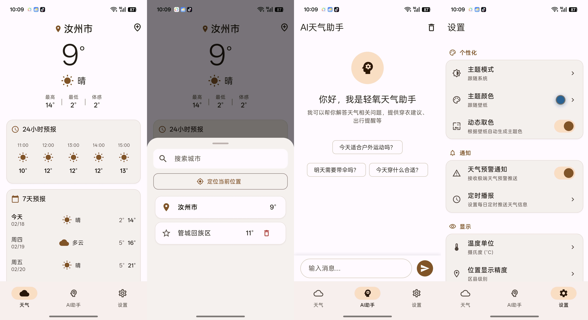

# 轻氧天气 (Pure Weather)

一款使用 Flutter 和 Material You Design 构建的现代化 Android 天气应用。

## 预览

轻氧天气是一款设计精美、功能丰富的天气应用，采用 Material You（Material Design 3）设计语言，支持动态主题色、多城市管理、实时天气数据等功能。



截图展示了应用的主要功能界面，包括天气主页、城市搜索、AI助手和设置页面。

## 特性

### 🌤️ 多数据源天气
- **和风天气 API** - 提供实时天气、七日预报、小时预报、天气预警、生活指数等数据
- **彩云天气 API** - 提供分钟级降雨预测
- **高德地图 API** - 提供城市搜索、定位服务

### 🎨 Material You 设计
- 动态主题色（跟随系统壁纸生成主题）
- 现代化 UI 设计，流畅的动画效果
- 深色/浅色主题支持

### 📍 城市管理
- 支持添加多个城市
- 搜索并添加行政区、区县级别地点
- 城市列表拖拽排序
- 定位服务获取当前位置

### 📊 天气详情
- 实时温度、体感温度
- 小时级预报
- 七日天气预报（当天显示实况天气）
- 空气质量指数 (AQI)
- 天气预警提醒
- 生活指数（穿衣、运动、洗车等）

### 🔔 通知提醒
- 极端天气预警推送
- 可配置自动刷新间隔

### 🤖 AI 助手
- 基于 DeepSeek API 的智能天气问答助手

## 技术栈

| 分类 | 技术 |
|------|------|
| 框架 | Flutter 3.35.7 |
| 状态管理 | Riverpod 2.6+ |
| 网络请求 | Dio |
| 数据模型 | Freezed + JSON Serializable |
| 本地存储 | SharedPreferences |
| 定位服务 | Geolocator |
| 动画 | Flutter Animate |
| 图表 | FL Chart |

## 项目结构

```
lib/
├── core/                    # 核心配置
│   ├── constants/           # 常量配置（API、版本等）
│   └── theme/              # 主题配置
├── models/                 # 数据模型
│   └── weather_models.dart # 天气数据模型（Freezed）
├── providers/              # 状态管理
│   ├── city_provider.dart  # 城市管理
│   ├── weather_provider.dart# 天气数据
│   ├── settings_provider.dart# 设置
│   └── theme_provider.dart # 主题管理
├── screens/                # 页面
│   ├── main_screen.dart    # 主页面
│   ├── weather/            # 天气详情页
│   ├── city_management/    # 城市管理页
│   ├── settings/           # 设置页
│   └── ai_assistant/       # AI 助手页
├── services/               # API 服务
│   ├── qweather_service.dart  # 和风天气 API
│   ├── caiyun_service.dart    # 彩云天气 API
│   ├── location_service.dart  # 高德地图定位
│   └── deepseek_service.dart  # DeepSeek AI
└── widgets/                # 通用组件
    ├── daily_forecast.dart    # 七日预报
    ├── hourly_forecast.dart   # 小时预报
    ├── air_quality_card.dart  # 空气质量
    └── weather_alert_card.dart# 天气预警
```

## 配置说明

### 环境变量

在项目根目录创建 `.env` 文件：

```env
# 和风天气 API（必填）
QWEATHER_API_KEY=your_qweather_api_key
QWEATHER_BASE_URL=https://devapi.qweather.com/v7

# 彩云天气 API（必填）
CAIYUN_API_KEY=your_caiyun_api_key
CAIYUN_BASE_URL=https://api.caiyunapp.com/v2.6

# 高德地图 API（必填）
AMAP_API_KEY=your_amap_api_key
AMAP_WEB_KEY=your_amap_web_key

# DeepSeek API（可选，用于 AI 助手）
DEEPSEEK_API_KEY=your_deepseek_api_key
DEEPSEEK_BASE_URL=https://api.deepseek.com/v1
```

### API 申请

1. **和风天气**: https://dev.qweather.com/
2. **彩云天气**: https://open.caiyunapp.com/
3. **高德地图**: https://lbs.amap.com/
4. **DeepSeek**: https://platform.deepseek.com/

## 本地部署教程

### 环境准备

1. **安装 Flutter SDK**
   - 下载并安装 Flutter SDK：[Flutter 官方下载](https://docs.flutter.dev/get-started/install)
   - 配置 Flutter 环境变量，确保 `flutter` 命令在终端中可用
   - 运行 `flutter doctor` 检查环境是否配置正确

2. **安装 Android 开发环境**
   - 安装 Android Studio：[Android Studio 官方下载](https://developer.android.com/studio)
   - 在 Android Studio 中安装 Android SDK、Android SDK Platform-Tools 和 Android SDK Build-Tools
   - 配置 Android 环境变量（`ANDROID_HOME`）

3. **克隆项目**
   ```bash
   git clone https://github.com/yourusername/PureWeather.git
   cd PureWeather
   ```

### 配置清华镜像源（推荐国内用户）

在项目根目录创建 `.flutterrc` 文件：

```json
{
  "flutter": {
    "hosted": "https://mirrors.tuna.tsinghua.edu.cn/dart-pub",
    "pub": {
      "hosted": "https://mirrors.tuna.tsinghua.edu.cn/dart-pub"
    }
  }
}
```

或设置环境变量：

```bash
# Windows PowerShell
$env:PUB_HOSTED_URL="https://mirrors.tuna.tsinghua.edu.cn/dart-pub"
$env:FLUTTER_STORAGE_BASE_URL="https://mirrors.tuna.tsinghua.edu.cn/flutter"

# Windows CMD
set PUB_HOSTED_URL=https://mirrors.tuna.tsinghua.edu.cn/dart-pub
set FLUTTER_STORAGE_BASE_URL=https://mirrors.tuna.tsinghua.edu.cn/flutter

# Linux/macOS
export PUB_HOSTED_URL="https://mirrors.tuna.tsinghua.edu.cn/dart-pub"
export FLUTTER_STORAGE_BASE_URL="https://mirrors.tuna.tsinghua.edu.cn/flutter"
```

### API 配置

1. **申请 API Key**
   - 和风天气：https://dev.qweather.com/（注册并创建应用，获取 API Key）
   - 彩云天气：https://open.caiyunapp.com/（注册并创建应用，获取 API Key）
   - 高德地图：https://lbs.amap.com/（注册并创建应用，获取 API Key 和 Web Key）
   - DeepSeek（可选）：https://platform.deepseek.com/（注册并创建应用，获取 API Key）

2. **创建配置文件**
   - 在项目根目录创建 `.env` 文件
   - 复制 `.env.example` 文件内容并填写你的 API Key

   ```env
   # 和风天气 API（必填）
   QWEATHER_API_KEY=your_qweather_api_key
   QWEATHER_BASE_URL=https://devapi.qweather.com/v7
   
   # 彩云天气 API（必填）
   CAIYUN_API_KEY=your_caiyun_api_key
   CAIYUN_BASE_URL=https://api.caiyunapp.com/v2.6
   
   # 高德地图 API（必填）
   AMAP_API_KEY=your_amap_api_key
   AMAP_WEB_KEY=your_amap_web_key
   
   # DeepSeek API（可选，用于 AI 助手）
   DEEPSEEK_API_KEY=your_deepseek_api_key
   DEEPSEEK_BASE_URL=https://api.deepseek.com/v1
   ```

### 依赖安装

```bash
# 获取依赖
flutter pub get

# 生成代码（如果使用了 Freezed 或 Riverpod Generator）
flutter pub run build_runner build --delete-conflicting-outputs
```

### 运行项目

1. **连接设备**
   - 连接 Android 设备到电脑，或启动 Android 模拟器
   - 运行 `adb devices` 确认设备已连接

2. **运行调试版**
   ```bash
   # 运行默认设备
   flutter run
   
   # 运行到指定设备
   flutter run -d device_id
   ```

3. **构建 APK**
   ```bash
   # 构建 Debug APK（体积较大，包含调试信息）
   flutter build apk --debug
   
   # 构建 Release APK（体积小巧，推荐）
   flutter build apk --release --target-platform android-arm64
   
   # 构建 App Bundle（Google Play 推荐格式）
   flutter build appbundle --target-platform android-arm64
   ```

4. **安装 APK**
   ```bash
   # 安装到连接的设备
   flutter install
   
   # 手动安装（找到构建的 APK 文件）
   # Debug APK: build/app/outputs/flutter-apk/app-debug.apk
   # Release APK: build/app/outputs/flutter-apk/app-release.apk
   adb install path/to/app.apk
   ```

### 常见问题解决

1. **依赖解析失败**
   - 确保已配置镜像源
   - 运行 `flutter pub get` 时添加 `--verbose` 查看详细错误信息
   - 尝试删除 `pubspec.lock` 文件后重新运行 `flutter pub get`

2. **构建失败**
   - 确保 Android SDK 已正确安装
   - 检查 `build.gradle` 文件中的依赖版本
   - 尝试清理构建缓存：`flutter clean`

3. **运行时权限问题**
   - 确保已在设备上授予定位和通知权限
   - 在应用设置中检查权限状态

4. **API 调用失败**
   - 检查 API Key 是否正确配置
   - 确认网络连接正常
   - 查看 API 服务是否有访问限制

## 版本历史

### v2.5.0
- 权限管理优化：首次运行时自动请求定位和通知权限
- 位置精度设置：支持选择不同精度的位置信息显示
- 导航栏重构：底部导航栏包含天气、AI助手、设置三个主要页面
- 应用初始化流程优化：冷启动自动定位并加载默认城市天气
- 通知系统完善：支持天气预警推送
- 界面交互优化：添加平滑的页面切换动画

### v2.2.0
- 城市管理重构：移除独立城市管理页面，改为天气详情页右上角添加城市选择器
- 城市列表优化：定位城市始终置顶显示，使用定位图标标识；手动添加城市使用收藏图标
- 搜索体验优化：键盘弹出时界面自动跟随上移，搜索结果移除地区归属信息
- 界面简化：移除搜索框上方的冗余信息，界面更加简洁
- 项目更新：包名改为 pureweather，GitHub 地址更新为 PureWeather
- 关于页面：使用应用图标替换默认天气图标

### v2.1.0
- 24小时预报优化：显示下一小时起24小时数据，响应式布局适配5小时显示
- 卡片布局统一：所有卡片左对齐，视觉风格一致
- 详情信息卡片：添加图标，调整位置至空气质量卡片下方
- API优化：小时预报改用72小时接口获取更完整数据

### v2.0.0
- 应用更名：律动天气 → **轻氧天气**
- 包名更新：com.echoran.lvdongweather → com.echoran.pureweather
- 新增「位置显示」设置：可选择显示区/县或具体地标/乡镇/街道
- 冷启动自动定位并切换到当前位置
- 自定义应用图标
- 仅支持 Android 平台（arm64-v8a）
- 移除 iOS 平台支持

### v1.2.1
- 七日预报当天天气使用实况数据，与顶部天气保持一致
- 优化城市搜索，支持行政区级别
- 修复空值显示问题

### v1.2.0
- 七日预报优化，只显示全天天气
- 修复城市管理页面空值显示

### v1.1.x
- 城市搜索功能优化
- Material You 动态主题色
- AI 助手功能

## 许可证

MIT License
